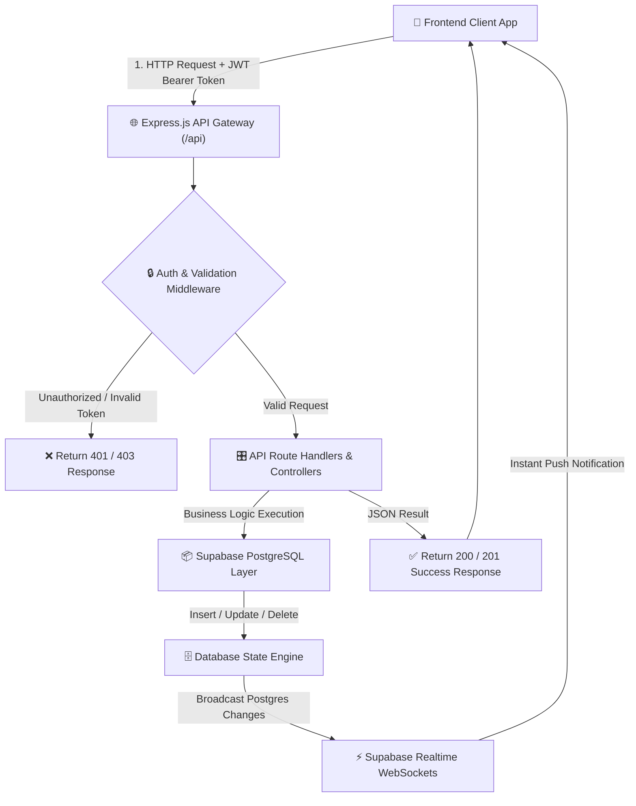
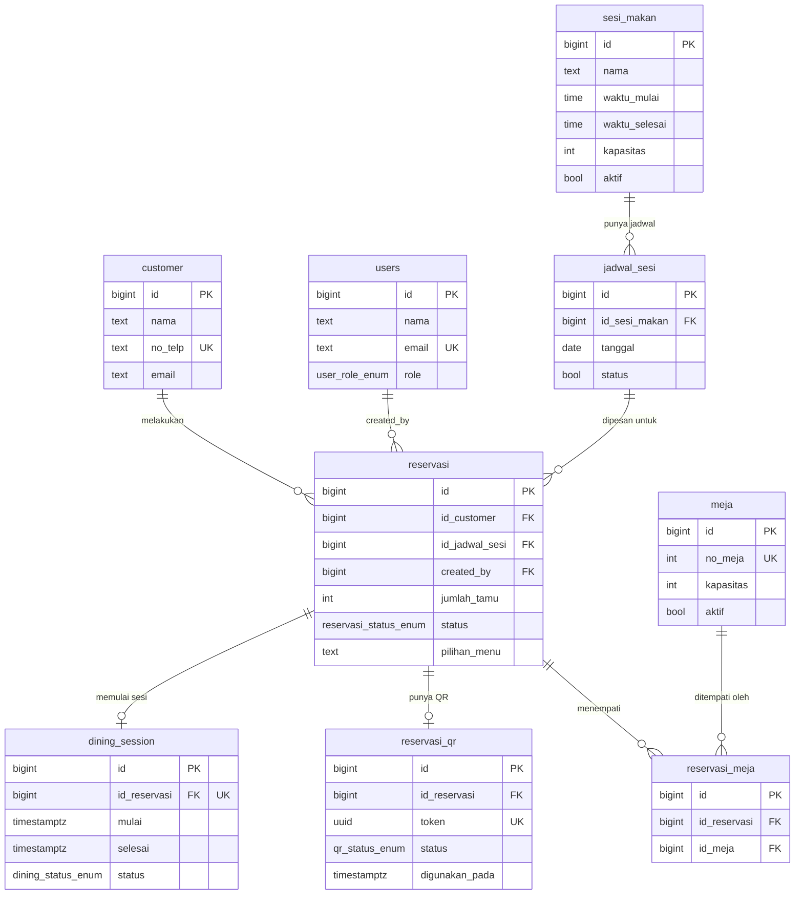
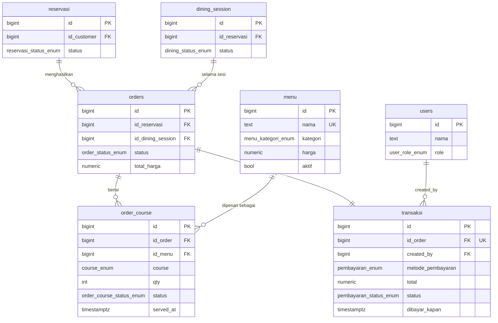
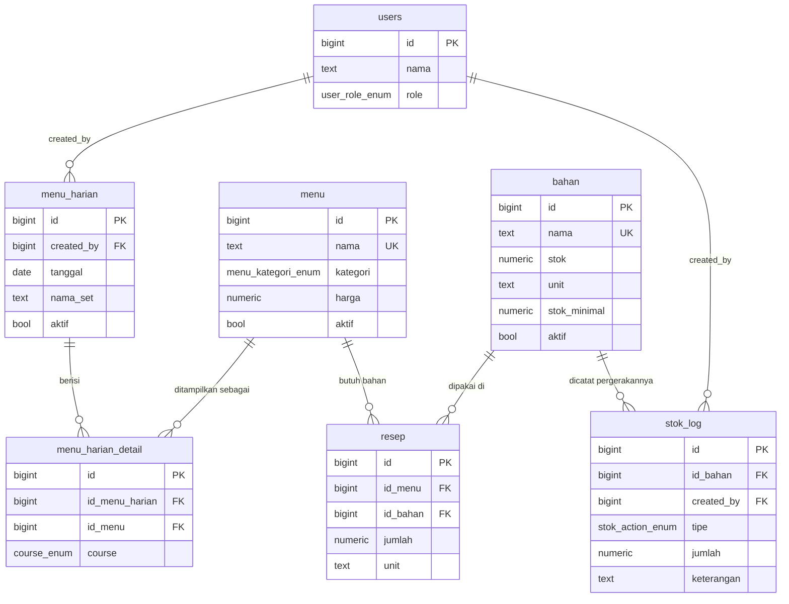
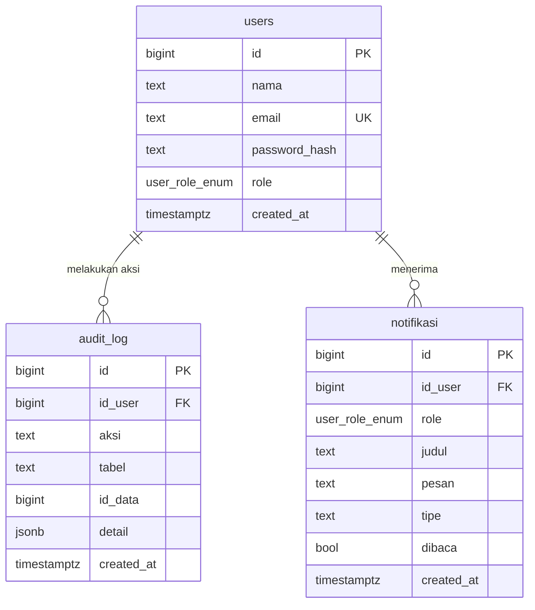

# ⚙️ RestoUnikom — RESTful API Server (Backend)

[](https://expressjs.com/)
[](https://expressjs.com/)
[](https://nodejs.org/)
[](https://supabase.com/)
[](https://jwt.io/)

**RestoUnikom Backend Server** adalah repositori API RESTful berbasis **Node.js (ES Modules) + Express.js** yang berfungsi sebagai mesin pemroses bisnis utama (*Business Logic Engine*) untuk sistem restoran fine dining berbasis sesi.

Server ini menangani otentikasi berbasis JWT, reservasi meja, pengontrolan alur penyajian *multi-course* fine dining, pengurangan stok bahan baku otomatis, transaksi pembayaran, serta integrasi data dengan **Supabase PostgreSQL**.

---

## 📑 Daftar Isi

- [🏛️ Arsitektur & Teknologi Server](#️-arsitektur--teknologi-server)
- [🔄 Diagram Alur Pemrosesan API Server (Mermaid.js Flowchart)](#-diagram-alur-pemrosesan-api-server-mermaidjs-flowchart)
- [🗄️ Diagram Skema Database (Mermaid.js ERD)](#️-diagram-skema-database-mermaidjs-erd)
  - [1. Reservasi & Meja](#1-reservasi--meja)
  - [2. Order & Pembayaran](#2-order--pembayaran)
  - [3. Menu & Inventory](#3-menu--inventory)
  - [4. Users, Audit Log & Notifikasi](#4-users-audit-log--notifikasi)
- [📁 Struktur Folder Server](#-struktur-folder-server)
- [📡 Direktori API Endpoints](#-direktori-api-endpoints)
- [🛠️ Panduan Instalasi & Pengaturan Environment](#️-panduan-instalasi--pengaturan-environment)

---

## 🏛️ Arsitektur & Teknologi Server

1. **⚡ Express.js 5.x ES Modules Architecture**:
   Menggunakan arsitektur JavaScript ES Modules (`import/export`) untuk performa tinggi, modularitas *routes*, *controllers*, dan *middleware*.

2. **🔒 Authentication & Role Security**:
   Pendaftaran dan login staf diamankan dengan **Bcrypt.js** untuk komparasi hash kata sandi dan **JSON Web Token (JWT)** untuk otorisasi akses rute terlindungi (*Role: OWNER, ADMIN, WAITER, CHEF, KASIR*).

3. **🗃️ Supabase PostgreSQL Integration**:
   Mengintegrasikan `@supabase/supabase-js` sebagai *Data Access Layer* langsung ke database PostgreSQL, mendukung operasi CRUD instan, relasi *Foreign Key*, dan *Realtime Broadcast Triggers*.

4. **📦 Automatic Ingredient Inventory Deduction**:
   Memiliki logika bisnis terintegrasi yang menghitung resep menu (`resep`) dan secara otomatis mengurangi stok bahan baku (`bahan`) serta mencatat entri log transaksi stok (`stok_log`) setiap kali pesanan diproses oleh Dapur.

---

## 🔄 Diagram Alur Pemrosesan API Server (Mermaid.js Flowchart)



---

## 🗄️ Diagram Skema Database (Mermaid.js ERD)

Skema lengkap dipecah jadi 4 diagram per domain supaya garis relasi tetap rapi dan gampang dibaca (satu diagram utuh untuk 20 tabel akan terlalu padat).

### 1. Reservasi & Meja



### 2. Order & Pembayaran



### 3. Menu & Inventory



### 4. Users, Audit Log & Notifikasi



---

## 📁 Struktur Folder Server

```text
server/
├── config/                     # Konfigurasi koneksi Supabase & environment
├── controllers/                # Logic Pemrosesan Bisnis (Auth, Reservasi, Orders, Transaksi, DLL)
│   ├── authController.js
│   ├── reservasiController.js
│   ├── diningSessionController.js
│   ├── orderController.js
│   ├── transaksiController.js
│   ├── menuController.js
│   ├── bahanController.js
│   └── notifikasiController.js
│
├── middleware/                 # Auth JWT, Role Checker, & Global Error Handler
│   ├── authMiddleware.js
│   └── errorHandler.js
│
├── routes/                     # Router Endpoints API Express
│   ├── index.js                # Master Router Entry (/api)
│   ├── authRoute.js
│   ├── reservasiRoute.js
│   ├── diningSessionRoute.js
│   ├── orderRoute.js
│   ├── transaksiRoute.js
│   ├── menuRoute.js
│   ├── bahanRoute.js
│   └── notifikasiRoute.js
│
├── .env                        # Variabel Lingkungan Server (GitIgnored)
├── index.js                    # Server Entry Point Express Listener
├── package.json                # Dependensi Backend & Script Nodemon
└── README.md                   # Dokumentasi Utama Repositori Server
```

---

## 📡 Direktori API Endpoints

Seluruh endpoint diawali dengan prefix `/api`:

| Modul | Method | Endpoint | Deskripsi |
| :--- | :---: | :--- | :--- |
| **Auth** | `POST` | `/api/auth/register` | Mendaftarkan akun staf baru |
| **Auth** | `POST` | `/api/auth/login` | Autentikasi staf & penerbitan token JWT |
| **Reservasi** | `GET` | `/api/reservasi` | Mengambil seluruh daftar reservasi |
| **Reservasi** | `POST` | `/api/reservasi` | Membuat reservasi tamu baru / walk-in |
| **Reservasi** | `PATCH` | `/api/reservasi/:id/status` | Mengubah status reservasi (`DATANG`, `SELESAI`, `BATAL`) |
| **Dining Session** | `GET` | `/api/dining-session` | Mengambil sesi dining yang sedang berjalan (`BERJALAN`) |
| **Dining Session** | `PATCH` | `/api/dining-session/:id/end` | Mengakhiri sesi dining meja |
| **Orders** | `GET` | `/api/orders` | Mengambil daftar bill & order meja |
| **Orders** | `POST` | `/api/orders` | Menambahkan order baru / add-on course |
| **Order Course** | `PATCH` | `/api/orders/course/:id/status` | Mengubah status masakan (`DIMASAK`, `SIAP`, `DISAJIKAN`) |
| **Transaksi** | `GET` | `/api/transaksi` | Mengambil riwayat transaksi |
| **Transaksi** | `POST` | `/api/transaksi` | Memproses pembayaran meja (`Cash`, `QRIS`, `Debit`) |
| **Notifikasi** | `GET` | `/api/notifikasi` | Mengambil notifikasi real-time per peran |

---

## 🛠️ Panduan Instalasi & Pengaturan Environment

### 1. Prasyarat Sistem
- Node.js v18.x atau versi yang lebih baru
- NPM v9.x atau Yarn

### 2. Instalasi Dependensi
Jalankan perintah berikut di dalam direktori `server/`:
```bash
npm install
```

### 3. Pengaturan Variabel Lingkungan (`.env`)
Buat berkas `.env` di direktori utama `server/`:
```env
PORT=5000
SUPABASE_URL=https://your-supabase-project.supabase.co
SUPABASE_SERVICE_ROLE_KEY=your-supabase-service-role-key
JWT_SECRET=your-secure-jwt-secret-key
```

### 4. Menjalankan Backend Server (Development)
```bash
npm run start
```
Server backend akan berjalan di `http://localhost:5000` dengan otomatis merefresh jika ada perubahan berkas (*Nodemon*).

---

## 📜 Lisensi
Dikembangkan untuk sistem operasional **RestoUnikom Fine Dining Management System (Server API)**. All rights reserved.
